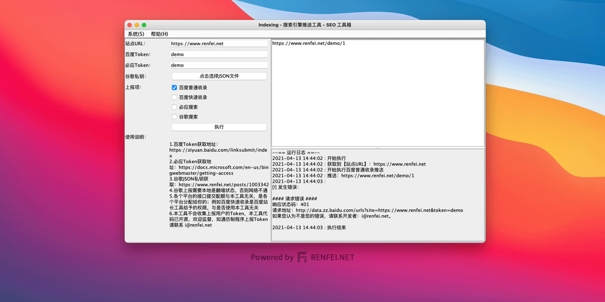
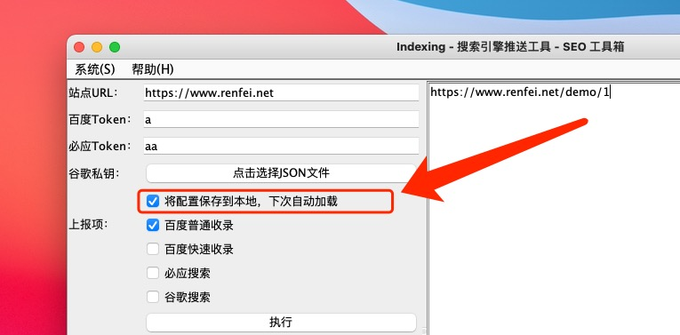
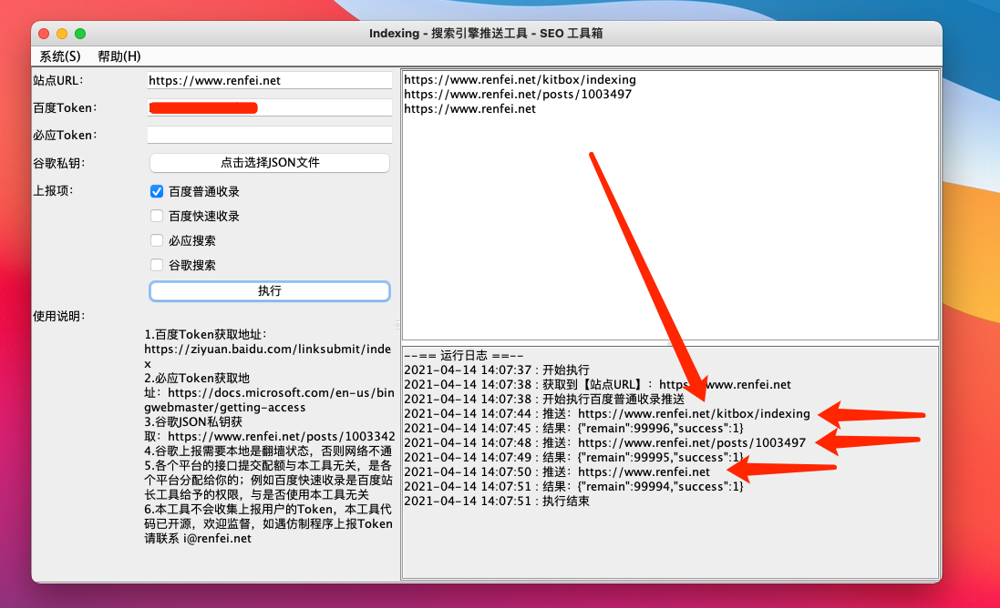

# Indexing - 百度-必应-谷歌 搜索引擎推送工具
此工具利用「百度-必应-谷歌」站长工具或开放平台接口即时推送网站更新给搜索引擎，加快蜘蛛程序爬取与更新。  
此工具代码作者已经使用多年，同时作者正在探索 Swing/AWT 编程，此工具作为作者 Swing/AWT 编程处女作，顺便将技术能力通过可视化界面分享出来，让不懂编程的站长也可以使用 API 接口的便利。

## 安全声明
作为软件开发工程师的我，深知安全的重要性，因为此工具运行时需要站长提供 API 的 Token 令牌，这就相当于密码授权。  
为了证明此工具不会抓取上传站长的 Token 令牌，所以开源公布出来，欢迎监督。（PS:本来想闭源使用混淆编译发布，防止被仿冒）  
因为开源以后任何人可以利用源码修改制作小版本，站长们请认准 renfei.net 官网。如果发现仿冒请向我举报。
### 配置文件安全告知
如果您勾选了「将配置保存到本地，下次自动加载」选项，您所填的站点URL、Token、JSON路径信息将以明文文件的形式保存在您本地硬盘文件系统中。此功能在「1.0.2」版本中被加入。  
通常这没什么问题，但出于安全性考虑我需要告知您以下信息：
- 您所填的站点URL、Token、JSON路径信息将以明文(未加密)文件的形式保存在您本地硬盘文件系统中。
- 其他拥有硬盘文件系统读写权限的程序可以访问到配置文件，例如有病毒扫描磁盘时可能会被读取。
- 保存位置：程序将在用户目录下创建一个名为「Indexing.conf」的文件。
- 「用户目录」一般指用户所属目录，在Linux系统中一般路径为「/home/username」，在macOS系统中一般路径为「/Users/username」，在Windows系统中一般是桌面路径为「C:\Users\username\Desktop」。username指你的用户名。



## 使用帮助
本工具基于 Java8 制作，如果您拥有 Java8 或更高的 JDK/JRE 环境，可以直接下载 Jar 包文件，使用如下命令即可启动：
```bash
java -jar Indexing.jar
```
如果您不确定自己的环境是否拥有 JDK/JRE，我还提供了环境打包版本，由于操作系统不同请下载对应的版本，执行其中的 start 脚本。  
例如在 Windows 下，您只需双击 start.bat 文件。

### 运行效果图


## 发布与下载
请下载对应的环境，执行 start 脚本：
- Gitee发布与下载：[https://gitee.com/rnf/Indexing/releases](https://gitee.com/rnf/Indexing/releases)
- Github发布与下载：[https://github.com/renfei/Indexing/releases](https://github.com/renfei/Indexing/releases)

## 其他说明
- 百度Token获取地址： https://ziyuan.baidu.com/linksubmit/index
- 必应Token获取地址：https://docs.microsoft.com/en-us/bingwebmaster/getting-access#using-api-key
- 谷歌JSON私钥获取：https://www.renfei.net/posts/1003342
- 谷歌上报需要本地是"你懂得"状态，否则网络不通，总是触发关键词「根据相关法律政策,该内容无法显示」
- 360搜索Token获取：http://zhanzhang.so.com/sitetool/auto_include
- 各个平台的接口提交配额与本工具无关，是各个平台分配给你的；例如百度快速收录是百度站长工具给予的权限，与是否使用本工具无关
- 本工具不会收集上报用户的Token，本工具代码已开源，欢迎监督，如遇仿制程序上报Token请联系 i@renfei.net

### 关于360搜索的说明
360搜索并未提供提交API接口，此工具使用的是「360搜索自动收录」模拟JS运行提交的，获取Token的方法为，在 http://zhanzhang.so.com/sitetool/auto_include 中有如下代码：
```javascript
<script>
(function(){
var src = "https://jspassport.ssl.qhimg.com/11.0.1.js?d182b3f28525f2d3wgacfbs36e696dba";
document.write('<script src="' + src + '" id="sozz"><\/script>');
})();
</script>
```
其中```d182b3f28525f2d3wgacfbs36e696dba```就是要取出的Token。

### 代码仓库
- Gitee:[https://gitee.com/rnf/Indexing](https://gitee.com/rnf/Indexing)
- Github:[https://github.com/renfei/Indexing](https://github.com/renfei/Indexing)
- Gitlab:[https://gitlab.com/renfei/Indexing](https://gitlab.com/renfei/Indexing)

### 求鼓励

如果这个项目帮助到了你，是否能给我点个免费的星星 (Star) 给个鼓励呢。高星项目我将持续关注努力更新的。